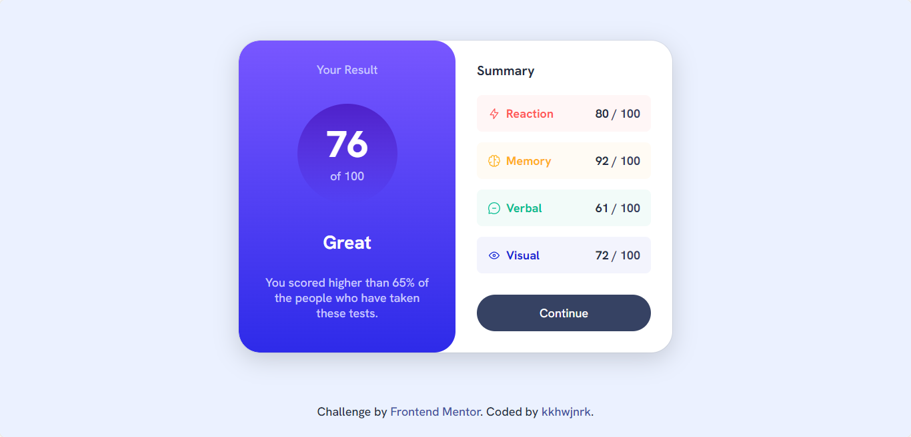

# Frontend Mentor - Results Summary Component 👨‍💻🔍

This project is my solution to the Results Summary Component challenge from Frontend Mentor. The challenge was to build a responsive webpage.

I built this project using mobile-first design principles and used HTML and SCSS for the layout and styling. To display the data on the webpage, I also used JavaScript.

### Live Site

You can view the live site for this project at [Live Site](https://results-summary.kkhwjnrk.vercel.app/)

### Frontend Mentor Profile

You can view my Frontend Mentor profile [@kkhwjnrk](https://www.frontendmentor.io/profile/kkhwjnrk)
